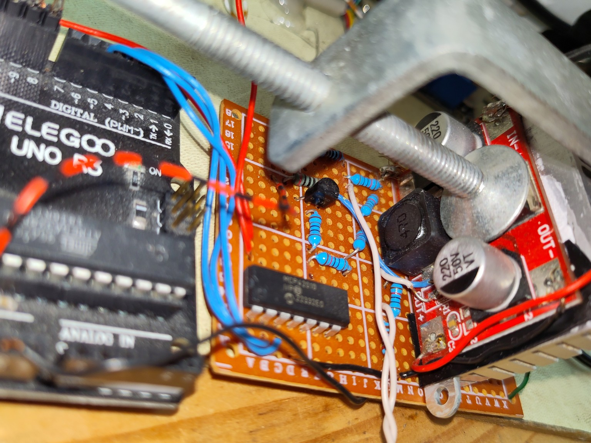

# LM2596 MPPT charger
This project uses a standard LM2596 based DC-DC step-down module to achieve MPPT of a solar panel.
It was built for a **30 Watt** solar panel with 21V open circuit / ~ 16V MPP voltage, which seems to be the maximum power rating for the poor LM2596 chip (which needs to be cooled with a heatsink)

In contrast to other solar MPPT projects using custom boards with ideally balanced circuits to achieve a very high efficiency, this re-uses an **off-the-shelf voltage stepdown module**, an Arduino and some other components to achieve **good-enough efficiency for small installations**. I am able to reach **80% efficiency** under full sunlight.

The single common ground level allows for easy voltage measurements.

## Main idea

To understand the concept behind this MPPT charger, we need to understand the base schematic of those LM2596 modules:

Simplified a lot, it works like this: The input voltage is by using a capacitor and fed into the LM2596 chip. It basically acts like a switch controlled with a very high frequency (in the 100kHz range), resulting in a PWM signal at the output oscillating between 0V and the input voltage. Using the inductor, diode and capacitor at the output as a low-pass filter, the output is smoothed to a stable lower voltage. The magic comes from the feedback loop: Through a resistor divider, the output voltage is fed back into the LM2596. It tries to keep the feedback pin at exactly 1.23 V. If the voltage at the feedback pin is too low, which means the output voltage itself is too low, it closes its internal switch and connects input to output. After a very short time, the output voltage has risen, so the feedback voltage gets too high. This makes the LM2596 disconnect its switch, so the voltage falls again. By doing this at very high frequency, the output voltage ever so slightly oscillates around the desired voltage. Through values in the resistor divider, the desired output voltage can be set - that's whats the potentiometer on the board is for.

When doing MPPT, we need to drive the solar panel at a specific voltage (which is about 80% of its open circuit voltage). And that's what we can use the LM2596's feedback loop for: Instead of taking it from the output, we need to derive the feedback signal from the input voltage. There's only one problem: When the feedback pin is too low, the chip believes the output is too low and therefore connects input to output to let current flow. In our modified case, things are the wrong way around: In this case, letting current flow means putting more load on the supply, i.e. the solar panel, which makes its voltage decrease even more.
To solve this problem, we use an NPN transistor to invert the feedback signal.
If now the **input voltage is too low**, the input to the inverting transistor is low, which means the output connected to the feedback pin is high(er than 1.23 V, that's all that really matters). The LM296 reacts to the high feedback by disconnecting the input from the output, removing the solar panel's load, **allowing its voltage to rise** - exactly what we want.
The same works in the opposite case. An **input voltage too high** leads to a high inverter input, therefore a low feedback pin makes the LM2596 put load on the panel, **dropping the voltage**.
Through high frequency oscillations, this allows driving the panel at a specific voltage.
Again, we can set this voltage by varying the resistor divider.

Our new schematic looks like this:

## the Arduino part

Driving the panel at a specific voltage works without active control by an Arduino.
Its task is to monitor the battery charge level and find the exact maximum power point by implementing a tracking algorithm. To allow it to control the resistor divider, we need to add a digital potentiometer IC whose resistance can be controlled in software. As the digital potentiometer, a **MCP42010** is used, which has 10 kOhm, 2 channels (only one used here) and 256 steps.

The current arduino firmware does not implement MPP tracking, instead it keeps the panel voltage at 16V and increases it to lower the power as the battery gets fully charged. This approach worked fine for me for the last few months.

There's no deep discharge protection for the battery when feeding the Arduino and USB ports!

## modding your LM2596 Board

As seen in the schematic, we need to locate the feedback loop on the board (highlighted in yellow)

Un-solder the potentiometer between feedback and out+ and the SMD resistor (labelled R2 on this PCB) between feedback and ground. Add a wire to the feedback pin to connect it to the new circuit.

The new schematic looks like this. The part at the top represents the original step-down module, the middle part the added resistor divider and transistor, and the entire bottom part is for controlling the digipot IC with an arduino.
The 3.3V supply needed for the transistor can be taken from the Arduino.

Transistor and resistor values have been chosen according to what was available.
Why is the digital potentiometer on the low side between ground and feedback? That's because, although it behaves like a "real" potentiometer, its connections must never exceed the 0 - VCC (5V) range. By putting the digipot on the low side, we ensure that we stay within this range and don't damage it.

My board looks like this:

I mounted the LM2596 module vertically onto a perfboard. There are some leftover wires and resistors from my prototyping stage which I don't bother removing. An old heatsink is clamped to the back, where the metal clamp cools the chip itself - simple, effective and silent.

To measure power, and solar and battery voltage, there are two **INA219** power sensor breakout boards connected via I²C. 

For my project, I made a nice case with analog meters, and buttons to switch between the internal battery (old RC battery pack with 6s NiMH) and an external one. A 5V regulator from a mechanically broken cigarette lighter adapter provides power to the Arduino and some USB ports on the front. The display is still work in progress.

It's pretty messy in there. Thank you for checking out this project, any comments are welcome :)

Inspired by this article by zabex (in German): [http://www.zabex.de/site/mpptracker.html](http://www.zabex.de/site/mpptracker.html)
